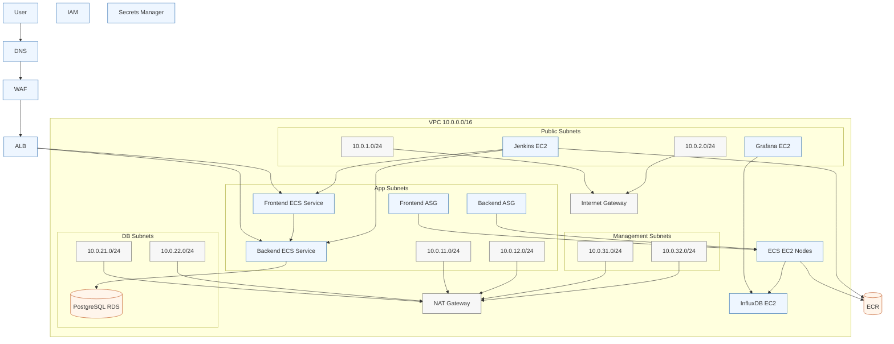

# Architecture

## Prompt

Create a clean AWS architecture diagram from this Terraform stack:

- VPC: `10.0.0.0/16`
- Public subnets: `10.0.1.0/24`, `10.0.2.0/24`
- App subnets: `10.0.11.0/24`, `10.0.12.0/24`
- DB subnets: `10.0.21.0/24`, `10.0.22.0/24`
- Management subnets: `10.0.31.0/24`, `10.0.32.0/24`
- Internet Gateway for public subnets
- NAT Gateway in public subnet `10.0.1.0/24`
- ALB in public subnets
- WAF in front of ALB
- ECS cluster on EC2 with two ASGs: frontend and backend
- ECS services: frontend on port `3000`, backend on port `5000`
- Frontend target group path `/`
- Backend target group path `/api/*` and health check `/api/health`
- Backend connects to PostgreSQL RDS in private DB subnets
- Jenkins EC2 in public subnet
- Grafana EC2 in public subnet
- InfluxDB EC2 in private app subnet
- ECR for frontend and backend images
- Secrets Manager for DB password
- Show traffic flow and subnet placement

Keep it diagrammatic, accurate, and minimal.
