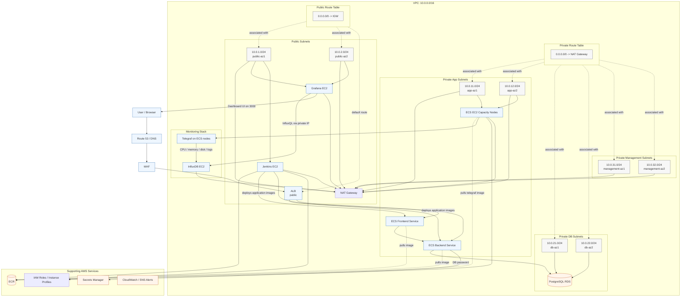

# Three-Tier Architecture

This diagram shows the full network layout, request flow, and monitoring path for the stack.

## Request Flow

1. The user hits the public endpoint through DNS.
2. WAF inspects the request.
3. ALB receives the request in the public subnet.
4. ALB forwards `/` traffic to the frontend ECS service.
5. ALB forwards `/api/*` traffic to the backend ECS service.
6. Frontend calls backend inside the private app subnets.
7. Backend reads and writes application data in PostgreSQL RDS.
8. ECS tasks and ECS EC2 nodes pull images from ECR.
9. Telegraf runs on every ECS node and ships metrics to InfluxDB.
10. Grafana reads InfluxDB over the private IP and renders dashboards.

## Subnet Layout

- `10.0.1.0/24` and `10.0.2.0/24` are public subnets.
- `10.0.11.0/24` and `10.0.12.0/24` are private app subnets.
- `10.0.21.0/24` and `10.0.22.0/24` are private database subnets.
- `10.0.31.0/24` and `10.0.32.0/24` are private management subnets.
- The VPC CIDR is `10.0.0.0/16`.

## Route Tables

- Public route table sends `0.0.0.0/0` to the Internet Gateway.
- Private route table sends `0.0.0.0/0` to the NAT Gateway.
- Public subnets use the public route table.
- App, database, and management subnets use the private route table.

## Monitoring Path

- ECS nodes expose host tags like `instance_id` and `private_ip`.
- Telegraf collects CPU, memory, disk, and log metrics.
- InfluxDB stores the data.
- Grafana presents an `Instance` dropdown so you can view each ECS node separately.

## Component Map

- `ALB` is the ingress point.
- `ECS Frontend` serves the UI.
- `ECS Backend` serves the API.
- `RDS PostgreSQL` stores persistent app data.
- `Jenkins` builds and deploys application images.
- `ECR` stores frontend and backend images.
- `Grafana` displays observability dashboards.
- `InfluxDB` stores node metrics and logs.
- `Telegraf` collects data from the ECS nodes.

